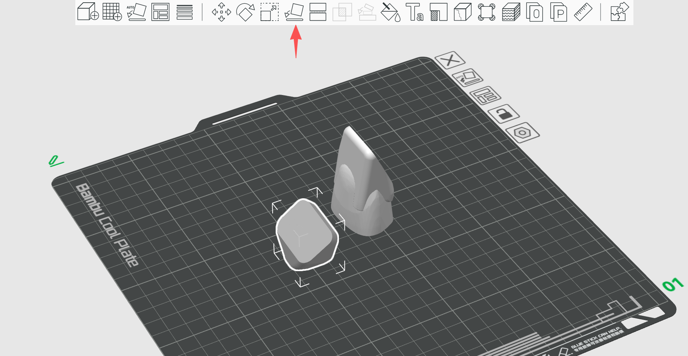
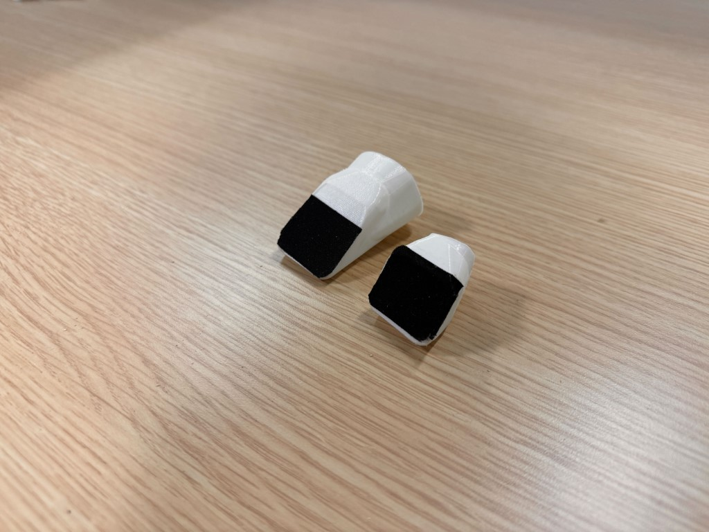
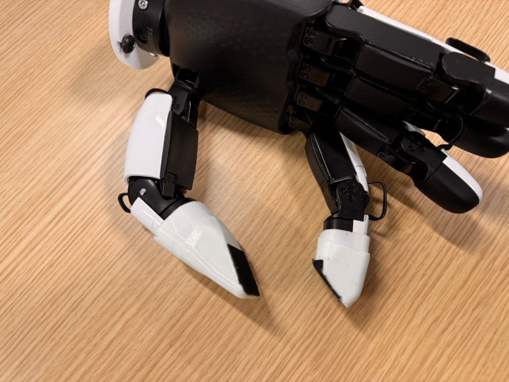
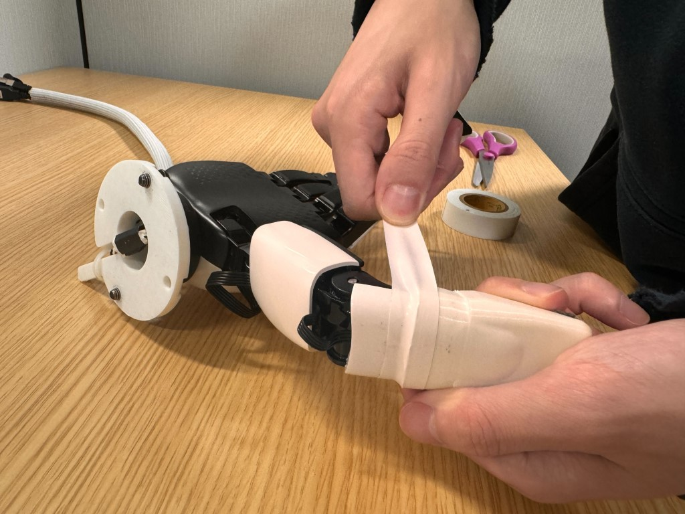
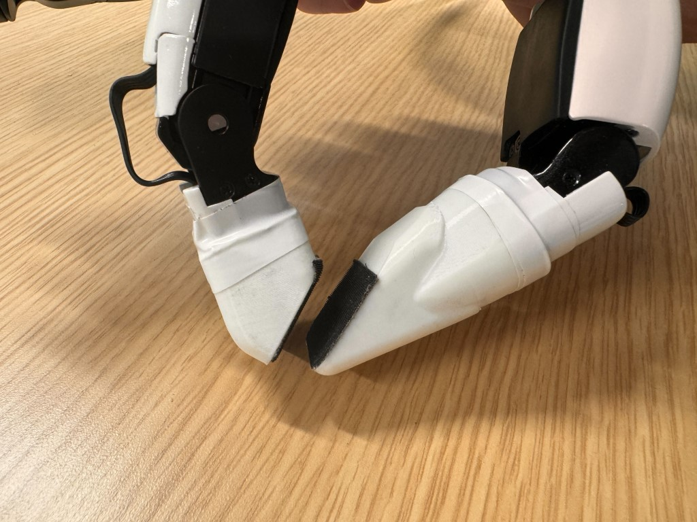
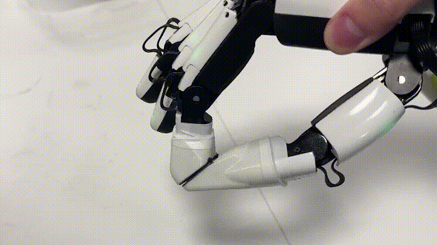

# Open Source Fingertip Resources for "Power to Precision" Project

Boost your dexterous hand’s manipulation ability — almost for free.

This repo offers fully open-source, 3D-printable fingertip *design geometry* and *control sequences* that instantly enhance fine-manipulation skills, enabling your dexterous hand to handle smaller and more delicate objects.

We currently support two hands — [**XHand**](https://www.robotera.com/en/goods1/4.html) and [**Inspire Hand**](https://en.inspire-robots.com/product/rh56dfx).
More hand models will be added, and the optimization scripts will also be released in future updates.

## Asset Links

| Hand Name                                                    | Thumb geometry | Index geometry | Control Sequence |
| ------------------------------------------------------------ | -------------- | -------------- | ---------------- |
| [**XHand**](https://www.robotera.com/en/goods1/4.html)       |  [thumb.stl](assets/xhand/thumb.stl)              | [index.stl](assets/xhand/index.stl)               | [control_seq.json](assets/xhand/control_seq.json)                 |
| [**Inspire Hand**](https://en.inspire-robots.com/product/rh56dfx) | [thumb.stl](assets/inspire_hand/thumb.stl)               | [index.stl](assets/inspire_hand/index.stl)               |                  |
|                                                              |                |                |                  |

## Prerequisites

1. 3D printer, with PLA or TPU (preferred) filament
2. Electrical insulation tape (e.g., [link](https://a.co/d/dLanJT1) or an equivalent one)
3. Scissors
4. **[Optional]** 3M anti-slip tape (e.g., [link](https://a.co/d/gBPgOIn) or an equivalent one)

## Procedure

We use *XHand* and *Bambu studio* as an example.

### a) 3D Printing

1. Import the `.stl` file into the 3D printing software:

<p align="center">
  
</p>


2. It is recommended to lay the model on this direction, which helps printing. (In bambu studio, you can use this button (red arrow) to reselect the bottom faces)

<p align="center">
  
</p>

3. Finally, enable the printing support on the left panel, and slice the plate. If everything goes fine, print it!

### b) Assembly

1. Use scissors to remove the excess 3D-printed support structures from the printed fingertip.
2. **[Optional]** Apply 3M anti-slip tape to the contact surface of the fingertip.

<p align="center">
  
</p>

3. Gently insert the fingertip onto the robot hand’s finger. Note that the friction may be high—avoid applying excessive force. Slowly wiggle the fingertip left and right while pushing until it is fully seated.

<p align="center">
  
</p>

4. Cut a ~10 cm piece of electrical tape, stretch it slightly, and wrap it around the joint between the fingertip and the finger.

<p align="center">
  
</p>
5. Finally it looks like this:

<p align="center">
  
</p>

### c) Testing

We use *XHand*'s API to test the hand. Install them according to official docs. We'll control xhand by the script `examples/example_xhand.py`. Run by:

```py
# apart from the XHand's SDK, install necessary packages:
# pip install numpy pynput
python examples/example_xhand.py
```

After starting the script, you can press keyboard `z` and `x` to make fingers open/close.

<p align="center">
  
</p>

==**! important: calibration**==

Since each real hand's calibration differs to each other, the provided control sequence may not be the best when deploying to your real hand. You may minorly adjust the control sequence to let it pinch better on your real hand based on the observation. In the `examples/example_xhand.py`, you can adjust it in line 88 of the file.

==**! important: high contact between fingers**==

Excessive contact between the thumb and index finger may damage the motors. Please limit the closing angle to ensure that, in the fully closed state, neither motor applies excessive force.

## License & Citation

The assets from this repo are distributed under MIT license.

If you found our project helpful, please cite our paper:

```bibtex
@misc{ye2025powerprecisionlearningfinegrained,
      title={From Power to Precision: Learning Fine-grained Dexterity for Multi-fingered Robotic Hands}, 
      author={Jianglong Ye and Lai Wei and Guangqi Jiang and Changwei Jing and Xueyan Zou and Xiaolong Wang},
      year={2025},
      eprint={2511.13710},
      archivePrefix={arXiv},
      primaryClass={cs.RO},
      url={https://arxiv.org/abs/2511.13710}, 
}
```


